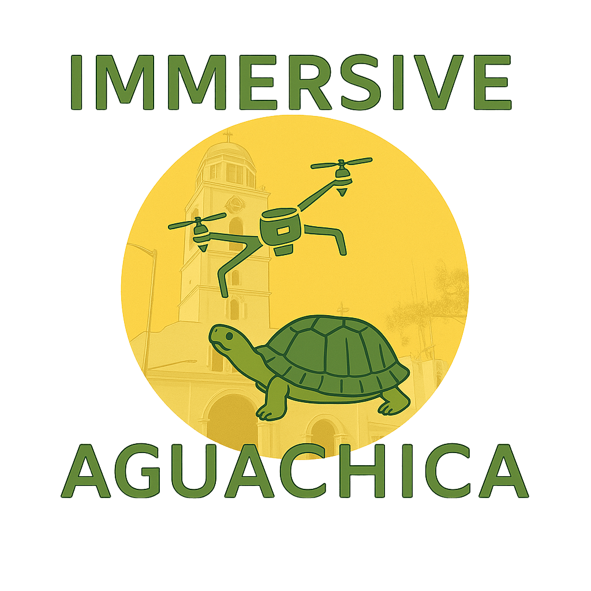

# Immserviseaguachica 🏛️

> Plataforma de turismo cultural interactivo con modelos 3D para el municipio de Aguachica, Colombia — MVP desarrollado para IS2 2026 Grupo 06.

[](https://developer.mozilla.org/en-US/docs/Web/HTML)
[](https://nodejs.org/)
[](https://expressjs.com/)
[](https://www.mysql.com/)
[](LICENSE)

---

## 📖 Description

**Immserviseaguachica** is an interactive cultural tourism web application built for the municipality of Aguachica, Colombia. It allows visitors and locals to explore iconic landmarks and cultural heritage through immersive 3D models rendered directly in the browser. The platform includes a full backend with user authentication, an admin panel, contact forms, statistical tracking, and a geolocation-based places directory.

---

## ✨ Features

- 🗺️ **Interactive Cultural Map** — Browse and discover cultural landmarks in Aguachica
- 🏛️ **3D Model Viewer** — Explore detailed `.glb` 3D models of iconic local sites such as the Iglesia de San Roque and the Patrón San Roque
- 👤 **User Authentication** — Secure login and registration with JWT-based middleware
- 🛡️ **Admin Panel** — Manage places, models, and content through a protected admin interface
- 📊 **Statistics Dashboard** — Track platform usage and visitor engagement metrics
- 📬 **Contact Form** — Allow visitors to send inquiries directly through the platform
- 📍 **Places Directory** — Curated list of local points of interest
- 📱 **QR Code Integration** — Quick access via QR code for mobile visitors

---

## 🛠️ Tech Stack

| Layer       | Technology                             |
|-------------|----------------------------------------|
| Frontend    | HTML5, CSS3, Vanilla JavaScript        |
| 3D Rendering| GLB/GLTF models (Three.js compatible) |
| Backend     | Node.js, Express.js                    |
| Database    | MySQL (schema managed via SQL script)  |
| Auth        | JWT (JSON Web Tokens)                  |
| Dev Tools   | Nodemon, dotenv                        |

---

## ✅ Prerequisites

Ensure the following are installed on your system before getting started:

- [Node.js](https://nodejs.org/) `>= 16.x`
- [npm](https://www.npmjs.com/) `>= 8.x`
- [MySQL](https://www.mysql.com/) `>= 8.0`
- A modern web browser (Chrome, Firefox, Edge)

---

## 🚀 Installation

### 1. Clone the repository

```bash
git clone https://github.com/is2-2025-grupo06/Immserviseaguachica.git
cd Immserviseaguachica
```

### 2. Install dependencies

```bash
npm install
```

### 3. Configure environment variables

Copy the example environment file and fill in your values:

```bash
cp .env.example .env
```

Then open `.env` and set the required values (see [Environment Variables](#-environment-variables) below).

### 4. Set up the database

Import the provided SQL schema into your MySQL instance:

```bash
mysql -u your_user -p your_database < database/schema.sql
```

### 5. Start the server

```bash
# Development mode (with auto-reload)
npx nodemon backend/server.js

# Production mode
node backend/server.js
```

The server will start and be accessible at `http://localhost:PORT` (configured in your `.env`).

---

## 🖥️ Usage / Getting Started

1. Open your browser and navigate to `http://localhost:PORT`
2. The **home page** (`index.html`) presents the cultural tourism portal with an interactive map and navigation links.
3. Visit the **Models page** (`modelos.html`) to explore 3D models of cultural heritage sites such as:
   - `Iglesia San Roque` — Historic church model
   - `Patrón San Roque` — Patron saint figurine model
   - `Tortuga` — Local wildlife 3D representation
4. Use the **Contact** section to submit inquiries.
5. Admin users can log in through the `/admin` route to manage content and view platform statistics.

---

## 🔐 Environment Variables

The project uses a `.env` file for configuration. Copy `.env.example` to `.env` and populate the following variables:

| Variable       | Description                                      | Example                        |
|----------------|--------------------------------------------------|--------------------------------|
| `PORT`         | Port on which the Express server will run        | `3000`                         |
| `DB_HOST`      | MySQL database host                              | `localhost`                    |
| `DB_USER`      | MySQL database username                          | `root`                         |
| `DB_PASSWORD`  | MySQL database password                          | `yourpassword`                 |
| `DB_NAME`      | MySQL database name                              | `immserviseaguachica`          |
| `JWT_SECRET`   | Secret key for signing JWT tokens                | `your_super_secret_key`        |

> ⚠️ **Never commit your `.env` file to version control.** It is already listed in `.gitignore`.

---

## 📁 Project Structure

```
Immserviseaguachica/
│
├── backend/
│   ├── config/
│   │   └── db.js               # MySQL database connection setup
│   ├── middleware/
│   │   └── auth.js             # JWT authentication middleware
│   ├── routes/
│   │   ├── admin.js            # Admin panel routes
│   │   ├── auth.js             # Login / registration routes
│   │   ├── contacto.js         # Contact form routes
│   │   ├── estadisticas.js     # Statistics/analytics routes
│   │   ├── lugares.js          # Places/landmarks routes
│   │   └── modelos.js          # 3D models management routes
│   └── server.js               # Express app entry point
│
├── database/
│   └── schema.sql              # Database schema and initial setup
│
├── img/                        # Static images and assets
│   ├── codigoQR.jpg
│   ├── favicon.png
│   ├── fondo-aguachica.jpg
│   ├── logo.png
│   └── ...
│
├── models/                     # 3D model files (GLB format)
│   ├── iglesia_sanroque.glb
│   ├── patron_sanroque.glb
│   └── tortuga.glb
│
├── index.html                  # Main frontend entry point
├── modelos.html                # 3D model viewer page
├── .env.example                # Environment variable template
├── .gitignore
└── INSTRUCCIONES.md            # Setup instructions (Spanish)
```

---

## 🤝 Contributing

Contributions are welcome! Please follow these steps:

1. **Fork** the repository
2. **Create** a new feature branch:
   ```bash
   git checkout -b feature/your-feature-name
   ```
3. **Commit** your changes with descriptive messages:
   ```bash
   git commit -m "feat: add interactive map filtering"
   ```
4. **Push** your branch:
   ```bash
   git push origin feature/your-feature-name
   ```
5. **Open a Pull Request** against the `main` branch and describe your changes in detail.

### Code Guidelines

- Follow existing code structure and naming conventions
- Keep routes RESTful and modular
- Document any new environment variables in `.env.example`
- Test your changes locally before submitting a PR

---

## 📄 License

This project is licensed under the **MIT License**. See the [LICENSE](LICENSE) file for details.

---

## 👥 Authors

Developed by **IS2 2026 — Grupo 06** as part of a software engineering course project focused on cultural heritage digitization for the municipality of Aguachica, Cesar, Colombia.

---

<p align="center">
  
  <br/>
  <em>Preserving culture through technology 🇨🇴</em>
</p>
